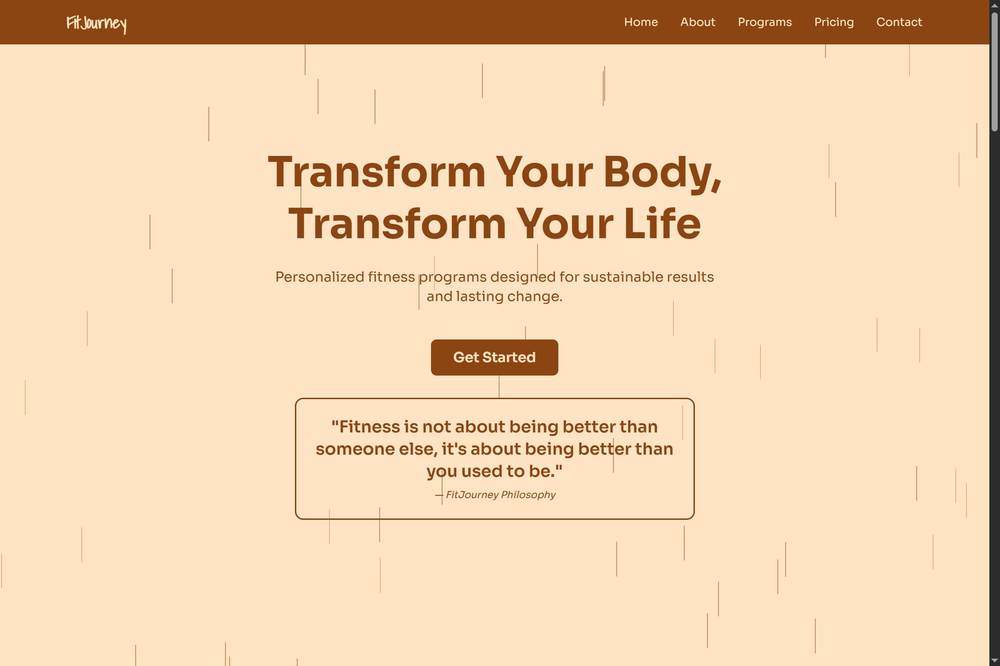
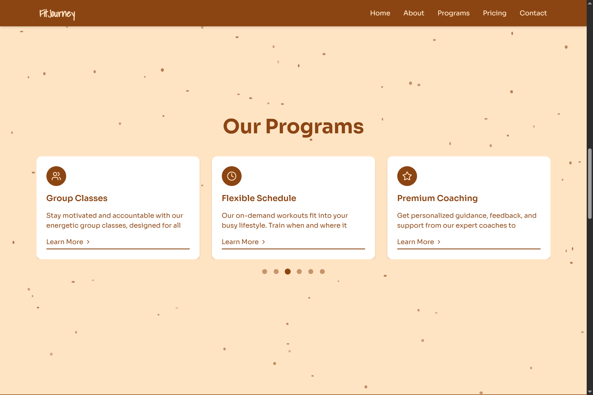
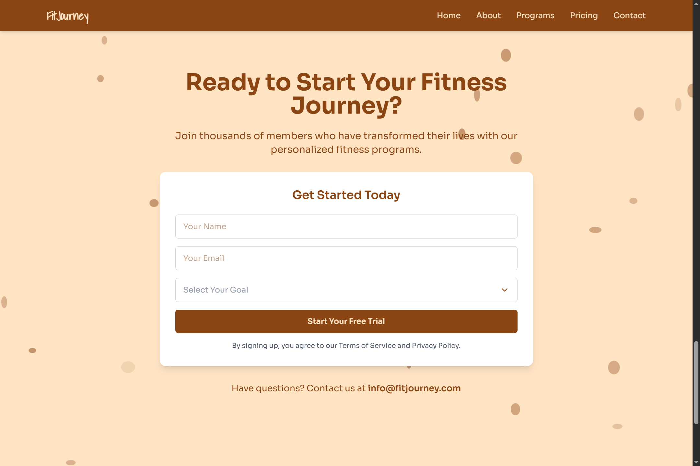

# 🏋️ FitJourney - Fitness Transformation Platform

<div align="center">
  
  
  
  
</div>

## 📱 Project Overview

FitJourney is a comprehensive fitness platform designed to help users transform their physical well-being through guided workout programs, personalized tracking, and interactive content.

## 🏆 Programs Section

The Programs Section showcases FitJourney's diverse workout offerings in an engaging, interactive format.

## 📸 Screenshots

<div align="center">
  
  
  
</div>

### ✨ Key Features

- **Responsive Design**: Dynamically adjusts from 1-3 columns based on viewport
- **Auto-rotating Carousel**: Cycles through programs at 3-second intervals
- **Interactive Controls**: User-friendly pagination with clickable indicators
- **Visual Enhancement**: Animated background particles create depth
- **Consistent UI**: Uniform card heights maintain visual harmony
- **Accessible Design**: Focus indicators and semantic HTML

### 🛠️ Technology Stack

- **React**: Component architecture for modular development
- **Swiper.js**: Touch-enabled carousel implementation
- **Lucide React**: Vector icons for program categories
- **Tailwind CSS**: Utility-first responsive styling
- **Custom Animations**: Particle effects and hover states


## 🎨 Design Elements

```css
/* Animated background particles */
.particle {
  position: absolute;
  background: rgba(139, 69, 19, 0.2);
  border-radius: 50%;
  animation: float 5s infinite ease-in-out;
}

@keyframes float {
  0%, 100% { transform: translateY(0) rotate(0deg); }
  50% { transform: translateY(-20px) rotate(10deg); }
}

/* Program card styling */
.program-card {
  background: white;
  border-radius: 1rem;
  box-shadow: 0 4px 6px rgba(0, 0, 0, 0.1);
  transition: transform 0.3s ease, box-shadow 0.3s ease;
}

.program-card:hover {
  transform: translateY(-5px);
  box-shadow: 0 10px 15px rgba(0, 0, 0, 0.1);
}
```

## 🚀 Getting Started

### Installation


1. Install required dependencies
```bash
npm install swiper lucide-react
```

2. Import necessary components and styles
```javascript
import { Swiper, SwiperSlide } from 'swiper/react';
import { Navigation, Pagination, Autoplay } from 'swiper/modules';
import { Dumbbell, Heart, Users } from 'lucide-react';

// Import Swiper styles
import 'swiper/css';
import 'swiper/css/navigation';
import 'swiper/css/pagination';
```

### Integration

```jsx
import ProgramsSection from './components/ProgramsSection';

function App() {
  return (
    <div className="app">
      <Header />
      <HeroSection />
      <ProgramsSection />
      <TestimonialsSection />
      <Footer />
    </div>
  );
}
```


## 🌐 Deployment

### Build for Production
```bash
npm run build
```

### Performance Optimization
- Implement lazy loading for program images
- Use the Swiper `preloadImages: false` option
- Consider using the `webp` image format

### Accessibility Considerations
- Include proper ARIA labels for carousel controls
- Ensure keyboard navigation for the carousel
- Maintain sufficient color contrast for text readability


## 🤝 Contributing

Contributions are welcome! Please feel free to submit a Pull Request.

---

<div align="center">
  Made with ❤️ using React and Swiper.js
</div>
